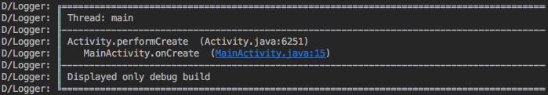

Set log level of release version with orhanobut/logger
===========

[](https://developer.apple.com/iphone/index.action)
[](https://developer.apple.com/swift)
[](http://mit-license.org)

# Overview
[orhanobut/logger](https://github.com/orhanobut/logger) is simple and useful log library.
This sample explains how to display only error level logs at release version.

## How to set?
### Define the log level to display
Define a custom class implementing LogAdapter.
BuildConfig.DEBUG will be false on release.
Only error level log is displayed in this sample.

```java
public class MyLogAdapter implements LogAdapter {
    @Override
    public void v(String tag, String message) {
        if (BuildConfig.DEBUG) {
            Log.v(tag, message);
        }
    }

    @Override
    public void d(String tag, String message) {
        if (BuildConfig.DEBUG) {
            Log.d(tag, message);
        }
    }

    @Override
    public void i(String tag, String message) {
        if (BuildConfig.DEBUG) {
            Log.i(tag, message);
        }
    }

    @Override
    public void w(String tag, String message) {
        if (BuildConfig.DEBUG) {
            Log.w(tag, message);
        }
    }

    @Override
    public void e(String tag, String message) {
        Log.e(tag, message);
    }

    @Override
    public void wtf(String tag, String message) {
        if (BuildConfig.DEBUG) {
            Log.wtf(tag, message);
        }
    }
}
```

### Initialize Logger
Initialize Logger and set MyLogAdapter in application.

```java
public class MyApplication extends Application {
    @Override
    public void onCreate() {
        super.onCreate();

        Logger.init(getString(R.string.app_name)).logAdapter(new MyLogAdapter());
    }
}
```

### Use it!
```java
Logger.d("Displayed only debug build");
```

This is a log sample for the debug version.



## Author

**R. Ayakix**

- Past works: [Product list](http://ayakix.com/) / [Waaaaay!](http://waaaaay.com/)
- Blogs: [English](https://medium.com/@Ayakix) / [Japanese](http://blog.ayakix.com/)
- Contact: [Twitter](https://twitter.com/ayakix)
